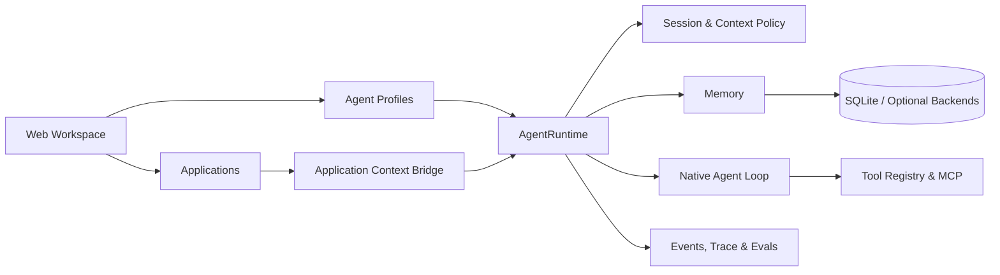

# KnowMe

**A framework-free, extensible personal agent platform.**

KnowMe is not a chat UI wrapped around an existing agent framework. It implements the agent loop, sessions, context management, memory, tool execution, and run tracing directly in Python, then composes those capabilities into different Agents and Applications.

[](pyproject.toml)
[](https://docs.astral.sh/uv/)
[](LICENSE)

[简体中文](README.md)


## Why it is a platform

The core of KnowMe is not one fixed assistant. It is a reusable personal-agent runtime:

- **An Agent is configuration, not another runtime.** Each Agent declares its prompt, tool scope, model, context policy, and run budget, then executes on the shared `AgentRuntime`.
- **An Application is more than a chat page.** Applications keep domain state such as a document, selection, or project file, then pass that working context to an Agent through the Context Bridge.
- **Execution is observable by default.** Memory gating, context compaction, model iterations, tool calls, workflow nodes, latency, and token usage appear in the Web timeline.
- **The orchestration core does not depend on an agent framework.** Loop, Session, Context Policy, Tool Registry, and Graph Engine are implemented in this repository; provider SDKs handle model transport.

“Framework-free” refers to the orchestration layer: the core does not depend on LangChain, LangGraph, CrewAI, or a similar agent framework. It does not mean zero third-party dependencies. The Web server uses the Python standard library, SQLite is the default store, and the frontend is plain HTML, CSS, and JavaScript with no build step.

## Web workspace

KnowMe organizes the same runtime into three product layers:

| Layer | Built-in today | Purpose |
| --- | --- | --- |
| **Agents** | General, Coding, Research | Different prompts and tool scopes for everyday, coding, and research work |
| **Applications** | Reader and document library, Knowledge Base, Coding Workspace, Deep Research | Stateful work surfaces that give an Agent a concrete task environment |
| **Management** | Overview, Ops, Memory, Behaviour, Models, Connections | Inspect runtime state and manage models, memory, and integrations |

The Reader also has a dedicated embedded Agent. It receives the open document and current selection instead of answering independently from the material.


### Platform capabilities

- Multi-Agent conversations with separate threads, history restoration, and idle-session rotation.
- A native Agent Loop with model calls, tool execution, result feedback, and an iteration guardrail.
- Context management with tool-result budgets, long-result pointers, conversation trimming, and state summaries.
- Semantic, episodic, and procedural memory, with `SKILL.md` loaded on demand.
- A retrieval gate that decides whether memory is needed, generates the query, and reports its hits.
- A unified tool system with schemas, per-Agent allowlists, safe execution, and MCP support.
- An Application Context Bridge for injecting the current resource, content, selection, and UI state into a turn.
- Live and historical observability through step timelines, JSONL traces, token usage, latency, and cost.
- A Web model workbench for providers, API keys, main/gate/summary models, and custom OpenAI- or Anthropic-compatible endpoints.

## Architecture



A normal turn follows this path:

```text
Web message
  → resolve AgentSpec
  → restore Session and Application Context
  → memory gate
  → fit the request through Context Policy
  → Agent Loop: model ↔ tools until a reply is ready
  → persist the conversation, memory, and trace
```

The core is intentionally explicit:

| Module | Responsibility |
| --- | --- |
| `knowme/core/loop.py` | Native observe → reason → act loop |
| `knowme/core/runtime.py` | Assembly of one complete Agent turn |
| `knowme/core/session.py` | Conversation history, restoration, and persistence |
| `knowme/core/context/` | Context budgets, compaction, and summary policies |
| `knowme/core/spec.py` | Reusable `AgentSpec` declarations |
| `knowme/core/tools.py` | Tool schemas, allowlists, and execution boundary |
| `knowme/memory/` | Retrieval gating, stores, consolidation, and skills |
| `knowme/applications/` | Application backends and the Context Bridge |
| `knowme/graph/` | The project's own graph runner and workflows |
| `knowme/ops/web/` | Local Web API and SSE event streaming |

## Quickstart

Requirements:

- Python 3.11+
- [uv](https://docs.astral.sh/uv/getting-started/installation/)
- An API key for a model provider that supports tool calling

After cloning the repository, run:

```bash
uv sync
uv run knowme
```

The terminal prints the actual URL. Defaults are:

- Windows: `http://localhost:8888`
- macOS / Linux: `http://localhost:7777`

If the port is unavailable, KnowMe automatically tries the following ports.

On the first launch:

1. Open **Models** in the sidebar.
2. Select a provider and enter its API key.
3. Fetch or enter a model ID, save it, and make the provider current.
4. Return to **General** and start the first conversation.

Provider settings are written to the local `.env`; custom provider definitions live in `.knowme/providers.json`. Both locations are ignored by Git.

## Extend with your own Agent

Every Agent runs on the same `AgentRuntime`. Adding one mainly means declaring an `AgentProfile`:

```python
AgentProfile(
    id="planner",
    name="Planner",
    icon="◇",
    description="Turn complex goals into executable plans.",
    spec=AgentSpec(
        name="planner",
        system_prompt="You are a planning agent...",
        tools=frozenset({"search_web", "save_note"}),
    ),
)
```

The runtime continues to own sessions, context, memory, tool execution, and tracing. An Agent only declares what makes it different.

## Extend with your own Application

An Application is a stateful work surface, not a second Agent Core. A new Application normally needs to:

1. Implement domain data and actions under `knowme/applications/`.
2. Add its Web API and frontend view.
3. Publish the current resource, content, selection, or UI state through `ApplicationContextBridge`.
4. Pass the rendered Application Context into the target Agent's next turn.

This makes it possible to add mail, project management, data analysis, or other workspaces without copying the Agent Loop. See [`docs/DEVELOPMENT_GUIDE.md`](docs/DEVELOPMENT_GUIDE.md) for the relevant code paths.

## Data and security boundaries

- The Web server only binds to `127.0.0.1`.
- Local data lives under `.knowme/`; the primary store is SQLite `state.db`.
- API keys live in the local `.env`. The Web UI reports whether a key is configured but does not return the full value.
- Conversations and tool context are sent to the selected model provider. Calendar, Notion, search, or MCP integrations make their corresponding external requests.
- Coding Workspace file writes and command execution are disabled by default and must be enabled explicitly in the Web UI.

See [`SECURITY.md`](SECURITY.md) for the full security model.

## Development and verification

Install development dependencies:

```bash
uv sync --extra dev
```

Run lint and the offline deterministic suite:

```bash
uv run ruff check knowme evals
uv run python -m pytest -q evals/deterministic
```

The deterministic suite uses a scripted client instead of a real model, so it requires no API key or network access.

## Documentation

- [`docs/DEVELOPMENT_GUIDE.md`](docs/DEVELOPMENT_GUIDE.md): code map and how to extend Agents, Applications, and Tools
- [`docs/CODING_WORKSPACE.md`](docs/CODING_WORKSPACE.md): Coding Workspace permissions and verification flow
- [`SECURITY.md`](SECURITY.md): local data, model requests, and tool permission boundaries

## Contributing

Issues and pull requests are welcome. Keep changes small and readable, and run lint plus the deterministic suite before submitting.

## License

[MIT](LICENSE)
