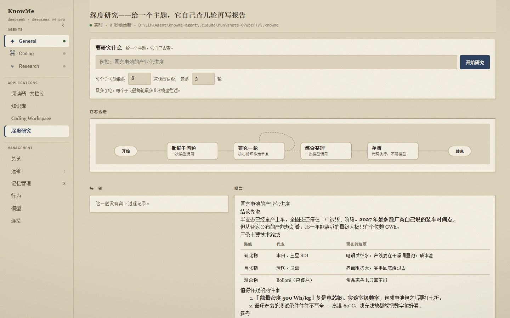

# KnowMe

**一个跑在你自己电脑上的个人 AI 助手。四根柱子 —— Harness · Loop · Memory · Eval —— 都是你能读完的 Python。**

[简体中文](README.md) | [English](README.en.md)

[](pyproject.toml)
[](knowme/core/loop.py)
[](knowme/db.py)
[](evals/deterministic)


## 这是什么

KnowMe 是**本地优先**的个人助手：它在你自己的机器上跑一个循环，能记住你的事、能调用工具、
能把"这一轮它到底干了什么"一步一步画给你看。

它不是框架，也没有插件市场。整个项目就是四件事：

| 柱子 | 负责什么 | 从哪读起 |
|---|---|---|
| **Harness** | 一次运行的外壳：装上下文、挂工具、把每一步发出去 | `knowme/core/runtime.py` |
| **Loop** | 一轮的骨架：模型 → 工具 → 模型，直到能回答 | `knowme/core/loop.py` |
| **Memory** | 三类记忆 + 一个门控：这一轮**要不要**查记忆、查什么 | `knowme/memory/` |
| **Eval / Ops** | 离线测试、模型当裁判、轨迹、发布门禁 | `evals/`、`knowme/ops/` |

## 它能干什么

**记忆分三类，而且什么时候用记忆是它自己决定的。** 门控会先判断这一轮要不要查记忆、
该查什么，然后把命中几条、命中哪条一起交出来 —— 这些**在页面上直接写着**，不是黑盒：

- **语义记忆**：持久事实（"周五下午一般不开会"）
- **情景记忆**：某天发生了什么，被提炼成一句话存下来
- **程序性记忆**：`SKILL.md` 技能。**只在匹配时才进提示词**，不匹配就不占上下文

**对话。** 网页里每个 Agent 是一个对话页（`#agent/<id>`）。三个角色 —— General / Coding /
Research —— 共用同一套记忆和一个 SQLite 库。

**图工作流。** 形状固定的事就给它一个形状，能叫得出名字：

| 斜杠命令 | 干什么 |
|---|---|
| `/gather` | 早报：四路并行取（GitHub / 网页 / 日历 / 记忆），最后合成一份 |
| `/deep_research <话题>` | 拆子问题 → 每个子问题一个子 agent 并行跑 → 汇总成带出处的报告 |
| `/triage <消息>` | 分流器。开着图工作流时它每轮都跑，手动调是用来"看着它选" |
| `/graphs` | 列出当前有哪些图工作流可跑 |

**应用层。** 阅读器 · 文档库（PDF / 网页进来、能划词提问）、知识库（笔记 + 中文分词搜索）、
Coding Workspace（让它改代码，改完自己跑验收命令）、深度研究。

**模型随便换。** 内置 11 家服务商（Anthropic / OpenAI / OpenRouter / Gemini / DeepSeek /
MiniMax / Kimi / GLM / xAI / OpenCode Zen / OpenCode Go），一家一个 key。也可以自己加一家：
写进 `.knowme/providers.json` 就出现在「模型」页上。

**工具。** 网页搜索与抓取、GitHub 读取、日历（Google / Apple）、文档库、笔记、记忆管理、
文件读写与命令执行、委派子任务、MCP 服务器 —— 一共 36 个，模型按需调用。

**每一步都看得见。** 门控查了什么、推理到第几轮、调了哪个工具、图跑到了哪个节点，
直播时有，回看时一样能翻到。

## 快速开始

**要准备什么：** Python 3.11+，和一个模型服务商的 key（挑最便宜的那家就行）。

```bash
git clone https://github.com/<你的用户名>/knowme-agent
cd knowme-agent
python -m venv .venv
```

```bash
# Windows
.venv\Scripts\activate
# macOS / Linux
source .venv/bin/activate
```

```bash
pip install -e .
cp .env.example .env
```

打开 `.env`，填两行（以 DeepSeek 为例，`.env.example` 里 11 家的写法都给了）：

```ini
KNOWME_PROVIDER=deepseek
DEEPSEEK_API_KEY=你的key
```

```bash
knowme
```

网页就起来了：**Windows 是 http://localhost:8888，macOS / Linux 是 http://localhost:7777**。
没填 key 也不会白屏 —— 它会直接告诉你缺哪一行、该写进哪个文件。

**试一句：**「记住我周五下午不开会。」→ 关掉 → 重开 → 「我周五下午有事吗？」

> 记忆就是一个 SQLite 文件：`.knowme/state.db`。打开它、读它、删它，都是你的事。

### 其他入口

| 命令 | 干什么 |
|---|---|
| `knowme` | 打开本地网页（默认就是这个） |
| `knowme web` | 同一件事（写全了给脚本用） |
| `knowme connections` | 现在配了哪些集成、通不通 |
| `knowme brief` | 早报：日历 + 邮件 + 记忆，**用循环跑的** |
| `knowme gather` | 同一件事，**用图跑的**：四路并行再汇总 |
| `knowme deep_research <话题>` | 跑一次深度研究，报告落到 `.knowme/outbox/` 和知识库 |
| `knowme skill install <url>` | 装一个技能到自己的 `.knowme/skills/` |

`make run / web / brief / gather / eval / eval-judge / gate / lint` 都是上面这些的快捷方式。

## 网页里有什么

侧栏里是 10 个页面，外加 3 个 Agent 对话页；另有 5 个运行内部页不在侧栏，从别处的链接进：

| 组 | 页面 |
|---|---|
| Agents | General · Coding · Research（3 个对话页） |
| Applications | 阅读器 · 文档库 / 知识库 / Coding Workspace / 深度研究 |
| Management | 总览 / 运维 / 记忆管理 / 行为 / 模型 / 连接 |
| 运行（不在侧栏） | 网关 / 循环 / 图工作流 / 工具 / 数据库 |

**总览**把架构画成一张可点的图，数字全是这一台机器上的真数：


**记忆管理**里能直接编辑、合并、删除事实；「运维」页看得到门控每个决定：


**深度研究**左边是这一趟每一轮的过程，右边是写出来的报告（还能回头翻以前跑过的）：



> 截图里的对话是**真跑的一轮**；记忆、笔记和报告用的是演示数据 —— 那份报告是直接写进
> 知识库的，没跑过工作流，所以左边显示「这一趟没有留下过程记录」。你自己跑的趟次会把
> 每一轮存下来，关掉再打开还能逐帧回看。

## 它怎么工作的

一次运行长这样：

```
你的话 → 门控（这轮要不要记忆？查什么？）→ 装工作记忆 → 模型推理
       → 要工具就调工具，结果回到模型 → 回复 → 存回记忆
```

几处值得单独看看的地方：

- **门控**（`knowme/memory/retrieval_gate.py`）：先用一次便宜的模型调用判断要不要查记忆，
  再决定用什么检索词。它的决定、检索词、命中的条目，页面上原样显示。
- **技能是按需注入的**：`SKILL.md` 的正文只在匹配到的时候才进提示词，
  平时提示词里只有一行"目录"。
- **循环和图是两件事**：形状固定用图，形状不固定用循环。为什么这么分见
  [`docs/loop-vs-graph.md`](docs/loop-vs-graph.md)。
- **扇出只发生在节点内部**：深度研究在一个节点里并行跑子 agent，而不是拆成一堆节点 ——
  这样"再来一轮"的回路才不会丢。
- **运行时没有框架**：HTTP 是 `http.server`，库是 `sqlite3`，模型走各家官方 SDK。
  前端也没有构建步骤 —— 14 个 JS 文件按固定顺序拼进同一个作用域。

## 项目结构

```
knowme/
  core/         运行时：loop 骨架、编排、会话、工具注册表、上下文压缩
  memory/       三类记忆 + 门控 + 整理（把聊过的提炼成事实）
  tools/        模型能调用的东西：搜索、日历、笔记、文档库、编码、MCP……
  graph/        图引擎 + 工作流（gather / triage / deep_research）
  agents/       三个角色的定义
  applications/ 阅读器、知识库、Coding Workspace、深度研究
  ops/          运维面：网页、轨迹、CLI、发布门禁
    static/js/  前端（无构建步骤，按顺序拼在一起）
evals/
  deterministic/  离线、过/不过的测试，不需要 key
  judge/          模型当裁判，打分的
skills/           随包发布的技能
sql/              Supabase 后端的建表 SQL
docs/             给人看的文档
```

## 测试

```bash
make lint    # ruff
make eval    # 离线确定性测试：不需要 key，也不需要网络
make gate    # 发布门禁：确定性必须全过，评分测试必须过线
```

`make eval` 里跑的是真的代码路径，模型那一层由假客户端 `ScriptedClient` 顶替，
所以它快、稳、不用花钱。要动模型判断力的地方（比如门控准不准）才用 `evals/judge/`。

## 文档

- [`docs/loop-vs-graph.md`](docs/loop-vs-graph.md) —— 循环和图，什么时候用哪个
- [`docs/CODING_WORKSPACE.md`](docs/CODING_WORKSPACE.md) —— 让它改代码，怎么限制它能碰哪里
- [`docs/integrations.md`](docs/integrations.md) —— 日历、邮件、Notion、MCP 怎么接
- [`docs/memory-backends-playbook.md`](docs/memory-backends-playbook.md) —— 换成 Supabase / mem0 / Zep 之后会怎样
- [`docs/agent-book/agent_context_management_guide.md`](docs/agent-book/agent_context_management_guide.md) —— 上下文管理是怎么一步步长出来的
- [`SECURITY.md`](SECURITY.md) —— 它默认能做什么、不能做什么

## 反馈

Issue 和 PR 都欢迎。这个仓库是**一个人写的、读得完的**，改动也尽量保持这个尺寸。
