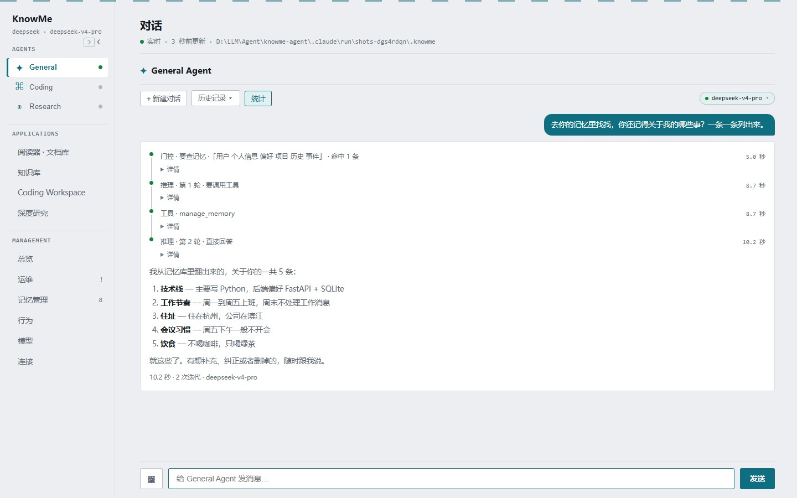
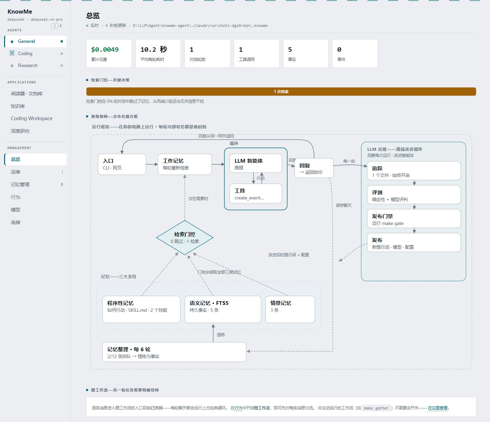
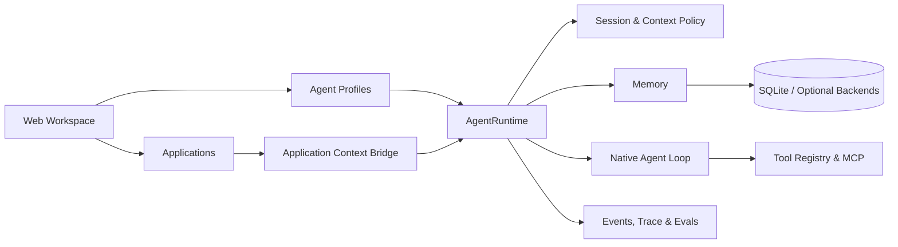

# KnowMe

**一个无框架、可扩展的 Personal Agent Platform。**

KnowMe 不是在现成 Agent 框架外面套一层聊天界面。它用原生 Python 实现 Agent Loop、会话管理、上下文管理、记忆、工具调度和运行轨迹，再把这些能力组合成不同的 Agent 与 Application。

[](pyproject.toml)
[](https://docs.astral.sh/uv/)
[](LICENSE)

[English](README.en.md)



## 为什么是一个 Platform

KnowMe 的核心不是某一个固定助手，而是一套可以反复组合的个人 Agent 运行底座：

- **Agent 是配置，不是另一套运行时。** 每个 Agent 由提示词、工具范围、模型、上下文策略和运行预算组成，共用同一个 `AgentRuntime`。
- **Application 不只是聊天页面。** Application 可以维护文档、选区、项目文件等页面状态，再通过 Context Bridge 把当前工作现场交给 Agent。
- **运行过程默认可见。** 一轮对话里的记忆门控、上下文压缩、模型迭代、工具调用、工作流节点、耗时和 Token 都会进入 Web 时间线。
- **核心编排没有依赖 Agent 框架。** Loop、Session、Context Policy、Tool Registry 和 Graph Engine 都在仓库中直接实现，模型通信使用服务商 SDK。

这里的“无框架”指 Agent 编排层不依赖 LangChain、LangGraph、CrewAI 等框架，并不表示项目没有第三方依赖。Web 服务使用 Python 标准库，默认存储使用 SQLite，前端是原生 HTML、CSS 和 JavaScript，没有构建步骤。

## Web 工作区

KnowMe 把同一套运行时组织成三个层次：

| 层次 | 当前内置内容 | 作用 |
| --- | --- | --- |
| **Agents** | General、Coding、Research | 用不同提示词和工具范围处理日常、编码和研究任务 |
| **Applications** | 阅读器与文档库、知识库、Coding Workspace、深度研究 | 给 Agent 提供具体工作场景、状态和交互界面 |
| **Management** | 总览、运维、记忆管理、行为、模型、连接 | 查看运行状态并管理模型、记忆和外部集成 |

Reader 还有一个嵌在阅读器中的专用 Agent。它会收到当前文档和选区，而不是脱离材料自由回答。



### 平台当前提供的能力

- 多 Agent 会话：独立对话线程、历史恢复、空闲后自动开启新会话。
- 原生 Agent Loop：模型调用、工具执行、结果回填和最大迭代保护。
- 上下文管理：工具结果预算、长结果指针化、会话裁剪和状态摘要。
- 三类记忆：语义事实、情景记录和按需读取的 `SKILL.md` 程序性记忆。
- 记忆门控：先判断当前问题是否需要记忆，再生成检索词并展示命中结果。
- 工具系统：统一 Schema、Agent 工具白名单、安全执行和 MCP 扩展。
- Application Context Bridge：把页面中的资源、正文、选区和状态注入当前会话。
- 可观测性：实时步骤、历史回放、JSONL Trace、Token、耗时和费用统计。
- 模型工作台：在 Web 中配置服务商、API Key、主模型、门控模型和摘要模型，也可添加 OpenAI/Anthropic 兼容端点。

## 架构



一次普通对话会经过下面这条路径：

```text
Web 消息
  → 读取当前 AgentSpec
  → 恢复 Session 与 Application Context
  → 记忆门控
  → Context Policy 调整请求窗口
  → Agent Loop：模型 ↔ 工具，直到得到回复
  → 保存会话、记忆和运行轨迹
```

核心代码保持小而明确：

| 模块 | 职责 |
| --- | --- |
| `knowme/core/loop.py` | 原生 observe → reason → act 循环 |
| `knowme/core/runtime.py` | 组装一次完整 Agent Turn |
| `knowme/core/session.py` | 会话历史、恢复和持久化 |
| `knowme/core/context/` | 上下文预算、裁剪和摘要策略 |
| `knowme/core/spec.py` | 可复用的 `AgentSpec` |
| `knowme/core/tools.py` | 工具 Schema、白名单和执行边界 |
| `knowme/memory/` | 记忆门控、检索、整理和技能 |
| `knowme/applications/` | Application 后端与 Context Bridge |
| `knowme/graph/` | 项目自己的图执行器和工作流 |
| `knowme/ops/web/` | 本地 Web API 与 SSE 流式事件 |

## 快速开始

需要：

- Python 3.11+
- [uv](https://docs.astral.sh/uv/getting-started/installation/)
- 任意一个支持工具调用的模型服务商 API Key

克隆仓库后，在项目目录执行：

```bash
uv sync
uv run knowme
```

终端会打印实际访问地址。默认是：

- Windows：`http://localhost:8888`
- macOS / Linux：`http://localhost:7777`

端口不可用时会自动尝试后续端口。

首次启动后：

1. 打开左侧的 **模型** 页面。
2. 选择服务商并填写 API Key。
3. 获取或填写模型 ID，保存并设为当前服务商。
4. 回到 **General** 开始第一段对话。

服务商配置由 Web 写入本地 `.env`；自定义服务商结构保存在 `.knowme/providers.json`。这两个位置都已被 Git 忽略。

## 扩展自己的 Agent

所有 Agent 都运行在同一个 `AgentRuntime` 上。新增 Agent 的主要工作是声明一个 `AgentProfile`：

```python
AgentProfile(
    id="planner",
    name="Planner",
    icon="◇",
    description="把复杂目标拆成可执行计划。",
    spec=AgentSpec(
        name="planner",
        system_prompt="You are a planning agent...",
        tools=frozenset({"search_web", "save_note"}),
    ),
)
```

运行时会继续负责会话、上下文、记忆、工具执行和轨迹。Agent 只声明自己与其他 Agent 不同的部分。

## 扩展自己的 Application

Application 是带状态的工作界面，而不是另一套 Agent Core。一个新的 Application 通常需要：

1. 在 `knowme/applications/` 中实现领域数据和操作。
2. 增加对应的 Web API 与前端页面。
3. 用 `ApplicationContextBridge` 发布当前资源、正文、选区或页面状态。
4. 将渲染后的 Application Context 交给目标 Agent 的下一轮运行。

这样可以继续增加邮件处理、项目管理、数据分析等 Application，而不用复制 Agent Loop。更具体的代码入口见 [`docs/DEVELOPMENT_GUIDE.md`](docs/DEVELOPMENT_GUIDE.md)。

## 数据与安全边界

- Web 服务只监听 `127.0.0.1`。
- 默认数据位于 `.knowme/`，主要状态存放在 SQLite `state.db`。
- API Key 保存在本地 `.env`，Web 只显示是否已配置，不回传完整 Key。
- 对话内容和工具上下文会发送给你选择的模型服务商；连接日历、Notion、搜索或 MCP 后，也会产生相应的外部请求。
- Coding Workspace 的写文件和执行命令能力默认关闭，需要在 Web 中显式开启。

完整说明见 [`SECURITY.md`](SECURITY.md)。

## 开发与验证

安装开发依赖：

```bash
uv sync --extra dev
```

运行静态检查和离线测试：

```bash
uv run ruff check knowme evals
uv run python -m pytest -q evals/deterministic
```

确定性测试使用脚本客户端替代真实模型，不需要 API Key 或网络。

## 文档

- [`docs/DEVELOPMENT_GUIDE.md`](docs/DEVELOPMENT_GUIDE.md)：代码入口和扩展 Agent、Application、Tool 的方法
- [`docs/CODING_WORKSPACE.md`](docs/CODING_WORKSPACE.md)：Coding Workspace 的权限与验收流程
- [`docs/loop-vs-graph.md`](docs/loop-vs-graph.md)：Agent Loop 和 Graph Workflow 的边界
- [`docs/integrations.md`](docs/integrations.md)：可选集成及所需配置
- [`docs/memory-backends-playbook.md`](docs/memory-backends-playbook.md)：替换默认记忆后端

## 参与贡献

欢迎提交 Issue 和 Pull Request。请保持改动小而可读，并在提交前运行 lint 和确定性测试。

## License

[MIT](LICENSE)
