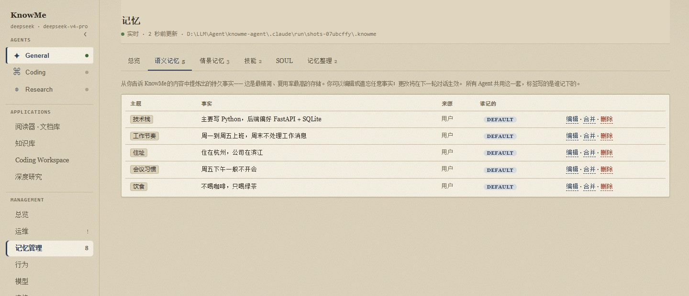

# KnowMe

KnowMe 是一个本地优先的个人 AI 助手：聊天、记忆、工具调用和运行过程都在你的电脑上管理。
它不是一个黑盒框架，而是一份可以顺着代码读懂的 Python 项目。

[](pyproject.toml)
[](LICENSE)
[](evals/deterministic)

[English](README.en.md)

> 本地优先不等于完全离线：模型请求会发送到你在 `.env` 中选择的服务商，状态和运行数据默认保存在本机。


## 能做什么

- 在本地网页中使用 General、Coding 和 Research 三个 Agent；阅读器会把当前材料带入对话。
- 用 SQLite 保存语义记忆、情景记忆和按需加载的 `SKILL.md` 技能。
- 调用网页搜索、GitHub、日历、文档、笔记、文件和 MCP 等工具。
- 用固定工作流完成早报、信息汇总和深度研究，并在页面中回看每一步。
- 在模型页切换服务商；内置服务商走各自的官方 SDK，也支持自定义 OpenAI/Anthropic 兼容端点。

## 快速开始

需要 Python 3.11 或更高版本，以及任意一个模型服务商的 API key。

```bash
git clone <your-repository-url>
cd knowme-agent
python -m venv .venv
```

激活虚拟环境：

```powershell
# Windows PowerShell
.\.venv\Scripts\Activate.ps1
```

```bash
# macOS / Linux
source .venv/bin/activate
```

安装项目并创建配置文件：

```bash
python -m pip install -e .
```

```powershell
# Windows PowerShell
Copy-Item .env.example .env
```

```bash
# macOS / Linux
cp .env.example .env
```

编辑 `.env`，选择一个服务商并填入对应的 key。以 DeepSeek 为例：

```ini
KNOWME_PROVIDER=deepseek
DEEPSEEK_API_KEY=your-api-key
```

启动网页：

```bash
knowme
```

程序会在终端打印实际地址。默认端口是 Windows 的 `8888`、macOS/Linux 的 `7777`；端口被占用时会自动顺延，也可以用 `KNOWME_WEB_PORT` 指定起始端口。

第一次可以试试：

1. 发送“记住我周五下午通常不开会”。
2. 重启 KnowMe。
3. 询问“我周五下午有事吗？”。

本地数据默认位于 `.knowme/`，其中 `state.db` 是 SQLite 数据库。它已被 `.gitignore` 排除，不会随着代码提交。

## 常用命令

| 命令 | 用途 |
| --- | --- |
| `knowme` 或 `knowme web` | 启动本地网页 |
| `knowme connections` | 查看集成配置和连通性 |
| `knowme brief` | 生成日历、邮件和记忆早报 |
| `knowme gather` | 并行收集多个来源后生成摘要 |
| `knowme deep_research <话题>` | 运行一次深度研究并保存报告 |
| `knowme skill install <url>` | 安装一个技能到本地 `.knowme/skills/` |

## 页面预览

总览页会把当前运行结构和统计画成一张图：


记忆管理页可以直接编辑、合并和删除事实：



## 项目结构

```text
knowme/
  core/          运行时、会话、工具注册和上下文管理
  memory/        语义 / 情景 / 程序性记忆及检索门控
  tools/         搜索、日历、文档、笔记、编码和 MCP 工具
  graph/         gather、triage、deep_research 等工作流
  agents/        Agent 角色和工具范围
  applications/  阅读器、知识库、Coding Workspace 等应用
  ops/           本地网页、CLI、轨迹和发布门禁
evals/           不依赖 API key 的确定性测试，以及模型评审测试
skills/          随项目发布的技能
sql/             Supabase 后端建表脚本
docs/            面向使用者和贡献者的说明
```

一次对话的主路径是：

```text
用户消息 → 记忆门控 → 组装上下文 → 模型推理 → 工具调用（可选） → 回复 → 保存记忆
```

想从代码读起，可以按 `knowme/core/runtime.py`、`knowme/core/loop.py`、`knowme/memory/` 的顺序阅读。循环和图工作流的取舍见 [`docs/loop-vs-graph.md`](docs/loop-vs-graph.md)。

## 测试和开发

安装开发依赖：

```bash
python -m pip install -e ".[dev]"
```

常用检查：

```bash
make lint
make eval
```

如果系统没有 `make`，可以直接运行：

```bash
python -m ruff check knowme evals
python -m pytest -q evals/deterministic
```

确定性测试使用脚本客户端替代真实模型，不需要 API key 或网络。更完整的代码入口、测试约定和新增工具方法写在 [`docs/DEVELOPMENT_GUIDE.md`](docs/DEVELOPMENT_GUIDE.md)。

## 文档

- [`docs/integrations.md`](docs/integrations.md)：日历、邮件、Notion、MCP 等可选集成
- [`docs/CODING_WORKSPACE.md`](docs/CODING_WORKSPACE.md)：Coding Workspace 的权限边界
- [`docs/memory-backends-playbook.md`](docs/memory-backends-playbook.md)：切换 Supabase、mem0 或 Zep
- [`docs/loop-vs-graph.md`](docs/loop-vs-graph.md)：循环和图工作流的区别
- [`SECURITY.md`](SECURITY.md)：默认权限、数据位置和安全注意事项

## 参与贡献

欢迎提交 Issue 和 Pull Request。提交前请先阅读 [`docs/DEVELOPMENT_GUIDE.md`](docs/DEVELOPMENT_GUIDE.md)，并确保 lint 和确定性测试通过。

## 许可证

本项目采用 [MIT License](LICENSE)。
