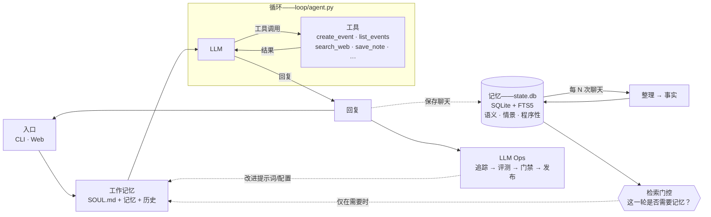
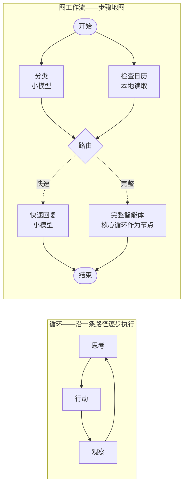

# knowme-agent

**属于你自己的 AI 助手。运行在你的笔记本电脑上，代码量少到一个下午就能读完。**

认识一下 **KnowMe**——一个本地优先的个人助手，它完整展示了所有成熟智能体背后的四大支柱：
**Harness（运行框架）· Loop（循环）· Memory（记忆）· Eval/LLM-Ops（评测与运维）**。
没有任何框架把关键细节藏起来。

- **本地优先。** 你的记忆保存在一个 SQLite 文件中。你可以打开它、读取它，它完全属于你。
- **记忆是主角。** 语义记忆 + 情景记忆 + 程序性记忆，并配有一道判断“是否需要记忆”的门控，以及一道判断“该保留什么”的整理流程。
- **核心循环只有约 95 行。** 全部是朴素的 Python，可以逐行调试。
- **看着它思考。** 本地仪表盘会实时展示每条消息如何流经整个运行框架。
- **内置评测。** 确定性测试与 LLM-as-judge 并列存在，并由发布门禁统一把关。


> 这是该系列视频中的系统设计白板。
> 图中的每个方框都对应一个实际文件——参见[白板如何映射到代码](#白板如何映射到代码)。

**▶ [观看 20 分钟代码导览](https://www.youtube.com/watch?v=rvRyBhILrls&list=PLE9hy4A7ZTmpGq7GHf5tgGFWh2277AeDR&index=42)**——现场讲解循环、三类记忆、评测、Telegram 网关以及“KnowMe KnowMe”唤醒词。

### ☕️ [请我喝杯咖啡](https://buy.stripe.com/5kA176bA895ggog4gh)——你的支持能让这个仓库和系列视频持续更新

## 快速开始

如果只想直接运行：

```bash
pip install knowme-agent
knowme                                    # 在终端中与 KnowMe 对话
knowme web                          # 或打开浏览器控制台 → localhost:7777
```

首次运行时，它会提示你需要设置哪个密钥。如果你想**阅读代码**（这正是本仓库的意义）或参与贡献，请克隆仓库：

```bash
git clone <your-repository-url> knowme-agent && cd knowme-agent
uv venv && uv pip install -e .          # 创建环境并安装 `knowme` 命令
cp .env.example .env                    # 选择一个服务商，填入一个密钥
uv run knowme                             # 在终端中与 KnowMe 对话
uv run knowme web                   # 或打开浏览器控制台 → localhost:7777
```

运行 `uv run knowme …` **不需要激活虚拟环境**。共有三种运行方式：

| 命令 | 适用场景 |
|---|---|
| `uv run knowme web` | 快速开始，无需激活环境（推荐） |
| `source .venv/bin/activate` → `knowme web` | 激活一次环境，之后整个终端会话中都可直接使用 `knowme` |
| `uv tool install .` → `knowme web` | 将 `knowme` **全局安装**，长期使用 |

`knowme` 和 `knowme web` 是进入**同一个** KnowMe 的两扇门。仪表盘是运行在本机的小型 Web 服务器，与 CLI 共用同一套记忆和 Agent 循环。（也可以使用 `make web`。）

**现在试一试。** 输入：“记住 Alex 更喜欢上午开会。”退出并重新启动，然后输入：“周五帮我约一次和 Alex 的叙旧会。”→ 它会记得这一偏好，并安排在上午 9 点。你的全部记忆都在一个文件里：`.knowme/state.db`。

**使用你已经在付费的模型。** 支持 Anthropic（默认）、OpenAI、Gemini、DeepSeek、MiniMax、Kimi、GLM、OpenRouter（一个密钥可使用数百个托管模型）、OpenCode Zen 和 OpenCode Go——设置 `KNOWME_PROVIDER=`，填入密钥即可。循环内部只使用一种统一协议；一个[约 60 行的适配器](../../knowme/loop/models.py)负责处理其余差异。

## 观察运行框架执行——仪表盘

```bash
knowme web          # 启动本地服务器 → http://localhost:7777
```

这是一个完全由你掌控的小型 Web 服务器（`127.0.0.1`，不依赖云端）。浏览器只是界面——每一轮对话仍由同一个进程执行。这是理解整个系统最快的方式。

每个标签页都有一个聊天面板。输入文字或直接**说话**，即可在 Overview 架构图中观察消息流经整个运行框架：门控亮起 → 循环调用工具 → 返回回复 → 更新记忆。前端完全由静态文件组成，不需要构建步骤。

每个标签页对应一个支柱，并直接关联实际代码：

| 标签页 | 你能看到什么 |
|---|---|
| **Overview** | 成本、延迟、门控的跳过/检索比例，以及可点击的架构图 |
| **Gateway** | 统一展示 CLI 和 Web 对话，每条消息都标注来源 |
| **Loop** | 每轮对话的门控决定、工具调用、Token 数和成本 |
| **Graph** | 图工作流：从引擎本身绘制的实时分流拓扑，以及每轮对话走过的路径 |
| **Memory** | 三类记忆各自的子标签页——语义事实、情景记录、可编辑技能与 SOUL、记忆整理 |
| **Tools** | 智能体可用的工具（按来源分组）、执行结果和 MCP 连接器 |
| **Data** | 实时 SQLite 浏览器：按表查看数据和结构，并对 `state.db` 使用只读 SQL 控制台 |
| **Ops** | 评测结论与历史、门控决策、最慢的对话轮次，以及内嵌 JSONL 追踪记录 |

侧栏和聊天面板都可以拖动调整大小，也可以隐藏；聊天区还提供与常见聊天应用相同的“新建对话”和历史记录功能。

## 值得尝试的操作（每项都展示一个核心支柱）

在聊天面板中输入以下内容（或运行 `make run`），并观察仪表盘上的变化：

| 试着输入 | 展示的能力 | 观察位置 |
|---|---|---|
| “Schedule a tennis game with Raj this Saturday at 8am” | 循环调用工具（`create_event`） | **LOOP** 方框闪烁；**Loop** 标签页显示 `iter 2` |
| “What's on my calendar today?” | 读取日历（`list_events`） | 它会根据 `state.db` 回答，而不是编造日程 |
| 先问“When am I swimming with Sergey?”，再问“what's 12 × 8?” | **检索门控**——检索与跳过 | Overview 的门控条；**Ops** 中每轮对话的决策 |
| “Remember that Raj prefers evening games” | 记忆自管理（`save_note`） | **Memory ▸ Semantic** 新增一条事实；`MEMORY.md` 同步更新 |
| “Search for the World Cup games still left to play and add each one to my calendar” | **多工具循环工程** | **Loop** 标签页显示 `iter 8`：`search_web` × N → `create_event` × N |
| 同时从 `make run` 和浏览器聊天 | 一个大脑，多个网关 | **Gateway** 标签页将消息标记为 `cli` / `web` |

**最精彩的演示**是世界杯示例。在同一轮对话中，KnowMe 会多次搜索网页、推理搜索结果，并把所有剩余比赛加入日历——整个过程包含 **8 次循环迭代**，并且实时可见。该演示需要免费的 `TAVILY_API_KEY`（可在 **Connections** 中填写）。观察 **LOOP** 方框在每次循环时闪烁，这就是现场可见的循环工程。

## 它与 ChatGPT / Claude Desktop 有什么不同？

ChatGPT 和 Claude Desktop 是你所**使用**的产品；这个项目则是一套你真正**拥有**的代码——循环、记忆结构、门控和评测框架全部可以阅读和修改。理解这个仓库，也就理解了这些产品底层的大体工作方式。

与 OpenClaw、Hermes 等大型开源助手相比呢？架构相似，但代码量只有其百分之一。前者是产品，而本项目是一份易读的蓝图。

## 白板画廊——可编辑的系统设计图

视频中的每一张白板都以**可编辑的 `.excalidraw` 源文件**保存在 [`docs/whiteboards/`](../whiteboards/) 中——下载后放入 [excalidraw.com](https://excalidraw.com)，即可改造成适合自己团队的版本：

| 图表 | 说明 |
|---|---|
| [`k3-architecture.excalidraw`](../whiteboards/k3-architecture.excalidraw) | Kimi K3：896 个专家中激活 16 个的 MoE、KDA + AttnRes 注意力，以及智能体循环成本为何会下降 |
| [`knowme-architecture.excalidraw`](../whiteboards/knowme-architecture.excalidraw) | KnowMe 本身——运行框架、循环、记忆支柱和 LLM Ops（[白板](../architecture-whiteboard.png)的可编辑重制版） |
| [`loop-vs-graph.excalidraw`](../whiteboards/loop-vs-graph.excalidraw) | 循环工程与图工程——能力阶梯，以及 `knowme brief` 和 `knowme gather` 实测运行的两条时间线（参见[相关文章](../loop-vs-graph.md)） |

白板源文件可用于理解和继续维护当前架构。

## 白板如何映射到代码

下面的图直接由 README 中的文本渲染（它是 [Mermaid](https://mermaid.js.org/) 文本，不是图片，因此可以直接在 PR 中编辑）：



每个方框都对应一个模块（包含所有文件路径的完整版本见 [docs/architecture.md](../architecture.md)）：

| 图中方框 | 模块 |
|---|---|
| 交互入口（CLI / Web） | [`knowme/gateway/`](../../knowme/gateway/) + [`knowme/ops/web/`](../../knowme/ops/web/) |
| 临时智能体运行 → 工作记忆 | [`knowme/runtime/session.py`](../../knowme/runtime/session.py) |
| 循环（LLM ↔ 工具、循环结束保护） | [`knowme/loop/agent.py`](../../knowme/loop/agent.py) |
| 图工作流（在循环外围提供结构） | [`knowme/graph/`](../../knowme/graph/) |
| 智能体工具（安排日程 / 记录笔记 / 发送消息） | [`knowme/tools/`](../../knowme/tools/) |
| 程序性记忆（SKILL.md，“如何行动”） | [`knowme/memory/procedural/`](../../knowme/memory/procedural/) + [`skills/`](../../skills/) |
| 语义记忆（长期事实、个人资料） | [`knowme/memory/semantic/`](../../knowme/memory/semantic/) |
| 情景记忆（带日期的事件、过往对话） | [`knowme/memory/episodic/`](../../knowme/memory/episodic/) |
| “是否真的需要检索？”门控 | [`knowme/memory/retrieval_gate.py`](../../knowme/memory/retrieval_gate.py) |
| 每 N 次聊天后整理 → 摘要器 | [`knowme/memory/consolidation.py`](../../knowme/memory/consolidation.py) |
| 追踪（每次运行一条 trace） | [`knowme/ops/tracing.py`](../../knowme/ops/tracing.py) |
| 评测：确定性评测与 LLM-as-judge | [`evals/deterministic/`](../../evals/deterministic/) 与 [`evals/judge/`](../../evals/judge/) |
| 门禁 → 发布 | [`knowme/ops/release_gate.py`](../../knowme/ops/release_gate.py) |

**关于 `MEMORY.md` 与 `state.db`。** 一些助手（例如 Hermes）使用单个 `MEMORY.md` Markdown 文件保存长期记忆。KnowMe 把可查询的真实数据保存在 `state.db`（其中的 `facts` 和 `episodes` 表可通过 FTS5 进行关键词搜索），并在每轮对话后重新生成一个便于阅读的 `.knowme/MEMORY.md` 镜像——因此既能获得可以直接打开的普通文件，也拥有可靠数据库的支持。仪表盘的 **Memory** 标签页提供友好视图，**Database** 标签页则展示原始 `state.db` 数据表。

## 循环——推理 → 行动 → 重复

没错，这里有一个真正的智能体循环，位于[约 95 行的朴素 Python 代码](../../knowme/loop/agent.py)中——没有 LangGraph，也没有隐藏的控制流。任务需要在循环外围增加结构时，该结构也只有约 200 行易读代码，参见下文的[图工作流](#图工作流当一轮对话需要明确结构)：

```
while not done:
    response = llm(messages, tools)      # 推理
    if response wants tools:
        results = run(tool_calls)        # 行动
        messages += results              # 观察
    else:
        done                             # 回复用户
```

每轮对话由两道保护机制负责结束：模型不再请求工具时自然结束，或者达到 `max_iterations` 时强制结束，绝不会无限循环。这就是“循环工程”：设计退出条件、完成工具往返，并把结果重新加入工作记忆。

**如何现场演示：**

1. 在聊天面板中输入 “schedule a swim with Sergey Saturday at 5pm”，观察 Overview 架构图中的 **LOOP** 方框亮起：推理 → `create_event` → 再次推理 → 回复。
2. 打开 **Loop** 标签页——其中列出每轮对话的门控决策、所有工具调用、**迭代次数**、Token 和成本。调用工具的一轮通常显示 `iter 2`（推理、行动、再次推理后回复）；普通回答则显示 `iter 1`。
3. 打开 **Ops** 标签页（或 `.knowme/traces/<today>.jsonl`），可以按顺序查看同一轮对话的原始事件：`turn_start → gate → llm → tool → llm → turn_end`。这就是被完整记录下来的循环。

**多工具循环（最精彩的演示）。** 一次工具调用已经构成循环，但真正体现循环工程价值的是工具的**串联**。试试输入：

> “Search for the World Cup games still left to play and add each one to my calendar.”

智能体会在两个工具之间循环：[`search_web`](../../knowme/tools/search.py) 读取网页，模型对结果进行推理，然后针对每场比赛分别调用一次 [`create_event`](../../knowme/tools/calendar.py)——一轮对话中会发生多次迭代。你会在 Loop 标签页中看到 `iter 4`、`iter 5`……，并看到 **LOOP** 方框在每次循环时闪烁。`search_web` 可以通过 DuckDuckGo 无密钥运行，但该端点会限制机器人请求；为了稳定演示，请设置免费的 `TAVILY_API_KEY`（参见 [`.env.example`](../../.env.example)）。

## 图工作流——当一轮对话需要明确结构

循环表示一轮智能体对话：模型不断选择工具，直到停止，这足以覆盖普通聊天。但有些工作具有明确的**结构**——若干步骤可以**同时**运行，还需要显式的“如果满足某条件，就走某条路径”式路由。**图工作流**把这种结构变成一等公民：节点各自完成一个任务（一个函数、一次 LLM 调用，或完整的一轮循环），边则规定下一步去哪里。它扩展了 Loop 支柱，而不是替代它：[`loop/agent.py`](../../knowme/loop/agent.py) 一行都不需要修改——图只是在循环周围安排调用，也可以直接把循环作为一个节点。它同样不依赖框架：整个引擎都在[一个易读文件](../../knowme/graph/engine.py)中，延续了核心循环的设计方式。



**内置示例：分流。** 设置 `KNOWME_GRAPH_WORKFLOWS=1`（写入 `.env`，或在仪表盘 Settings 中开启）后，**每条**消息都会先进入分流图——你不需要手动选择模式，运行框架会自行判断。小模型对消息分类的同时，系统会并行加载当天日历；“thanks!” 之类的消息会由小模型快速回复，不会唤醒大模型；“schedule a swim Saturday” 则会进入与原来完全相同的循环，该循环作为一个节点运行。任何环节发生故障——无论分类器、引擎还是其他组件——都会**失败后放行**到普通循环，因此该功能只会节省时间和 Token，不会导致没有回复。这是把检索门控的思想从单个判断扩展成结构。（图并不是一群互相聊天的智能体：执行路径完全由边确定，因此也能像系统其他部分一样被追踪和评测。）

**如何现场演示：**

1. 打开该开关并发送 “thanks!”——在 **Overview** 中，图面板会点亮快速路径，而 LOOP 方框保持熄灭，证明大模型没有被唤醒。
2. 发送 “schedule a swim Saturday 9am”——观察 `route → full_agent` 路径亮起，然后熟悉的循环动画接管流程。同一个循环，只是作为图中的一个节点运行。
3. 打开 **Graph** 标签页：其中的实时拓扑直接由引擎的 `describe()` 绘制，因此图示不可能与代码脱节。追踪文件（`.knowme/traces/<today>.jsonl`）会记录完整执行过程：`graph_start → node_start … route → graph_end`。

## 两个最值得关注的核心亮点

**1. 检索门控。** 大多数智能体会在每轮对话中都查询记忆库。这样不仅速度慢，更糟糕的是，无关记忆还会干扰回答。KnowMe 会先让一个低成本模型判断一个问题：这条消息究竟是否需要用到记忆？你可以直接在终端中观察：

```
you > what's 2+2?
  gate · skip — 纯数学问题
you > when am I meeting Alex?
  gate · retrieve — 涉及用户的日程安排
```

**2. 确定性评测与 LLM-as-judge。** “它是否创建了正确的日历事件？”是一个单元测试——结果只有 0 或 1，不需要模型来判断（`make eval`）。“回复是否有帮助？”则需要评判模型给出分数，并设置通过阈值（`make eval-judge`）。把这两种评测混在一起是最常见的评测错误；本项目将它们拆成独立测试套件，便于分别比较。`make gate` 会同时执行两者，作为发布门禁。

## 评测、追踪与捕获缺陷

三个命令、两类评测——这就是系统中 LLM-Ops 的一半：

```bash
make eval          # 确定性评测：“是否调用了正确工具？”——0 或 1，不使用评判模型
make eval-judge    # LLM-as-judge：“回复质量如何？”——百分制评分，需要模型密钥
make gate          # 发布门禁：确定性评测必须 100% 通过，模型评判必须超过阈值
```

确定性测试是 [`evals/deterministic/`](../../evals/deterministic/) 中普通的 pytest；模型评判测试则位于 [`evals/judge/`](../../evals/judge/)，使用 DeepEval。将二者分开正是重点——把“是否完成了动作”（单元测试）和“完成得好不好”（带主观性的评分）混为一谈，是评测系统中最常见的错误。

**在哪里查看结果：**终端和仪表盘的 **Ops** 标签页。这里会显示发布门禁结论、评测历史表（每执行一次 `make gate` 就增加一行，便于观察变化趋势）、每轮对话实际发生的门控决策，以及原始追踪记录。

**缺陷修复流程（值得在演示中展示的工程纪律）：**当你在实际使用中发现缺陷时，不仅要修复它，还要添加一个确定性测试，确保它永远不会再次出现。仓库中有一个真实例子：智能体过去不知道当前**时间**，因此在安排“30 分钟后”的日程前还会反问时间 → 该问题已在 [`session.py`](../../knowme/runtime/session.py) 中修复，并由 [`test_working_memory.py`](../../evals/deterministic/test_working_memory.py) 永久锁定。运行 `make gate` → 全部通过 → 评测历史记录本次结果。

**成本记录永久保留：**每次 LLM 调用的 Token 数都会追加写入 `.knowme/usage.jsonl`。这是一个只追加、不覆盖的账本，即使重置演示数据也不会被清空。**Ops** 标签页会显示累计成本、Token 总量，以及按日期和服务商划分的数据（美元成本根据 Token 估算，而 Token 数本身是真实记录）。因此，演示中看到的数字是真实的长期累计值，而不是一次会话的临时估算。

**追踪始终开启：**每轮对话都会把易读的事件行追加到 `.knowme/traces/<date>.jsonl`，无需任何配置。如需查看瀑布式 Span 视图：

```bash
pip install -e '.[tracing]'
make trace                                            # Phoenix → localhost:6006
OTEL_EXPORTER_OTLP_ENDPOINT=http://localhost:4317 make run
```

Langfuse 云服务也支持相同的 OTel 开关。

## 把它连接到你的生活

语音、Telegram、Apple 日历和邮件、Google 日历、MCP 服务器——每项集成都需要主动开启，使用各自的可选依赖，而且都不会改变核心循环。所有集成的设置方法参见：[docs/integrations.md](../integrations.md)。

## 它会管理自己的记忆

智能体拥有维护自身记忆的工具，因此这里不存在黑盒：

- **manage_memory**——当你指出事实有误时，更正或遗忘该事实。
- **update_soul**——保存你提出的长期偏好（存放在 `SOUL.md` 中）。
- **create_skill**——当你教给它一套可复用流程时，它会询问是否将其保存为技能（写入 `.knowme/skills/`，当前会话中立即生效）。

你也可以在仪表盘的 Memory 标签页中手动编辑这些内容（修改/删除事实、重写 `SOUL.md`），或在 Settings 中切换服务商和模型、填写密钥。密钥采用 BYOK 模式，仅保存在本地 `.env` 文件中，绝不会发送到浏览器。

## 添加技能——你自己的技能或社区技能

技能就是程序性记忆：只有在相关情况下才会加载的 Markdown 指令。

```bash
python -m knowme skill install https://github.com/<someone>/<repo>/blob/main/skills/<skill>/SKILL.md
```

**添加一个技能——它只是一个 Markdown 文件。** 复制 [`skills/TEMPLATE.md`](../../skills/TEMPLATE.md)，在 YAML frontmatter 中填写 `name` 和 `description`。

## 全部命令

安装软件包后会提供 `knowme` 命令；Makefile 中的目标是与之等效的快捷方式。

| 命令 | 功能 |
|---|---|
| `knowme` | 在终端中聊天 |
| `knowme web` | 在 localhost:7777（Windows 默认 8888）打开本地网页端 |
| `knowme brief` | 根据日历、邮件和记忆生成晨间简报 |
| `make trace` | 在 localhost:6006 打开 Phoenix 深度追踪瀑布图 |
| `make eval` | 确定性评测（0/1，不使用评判模型） |
| `make eval-judge` | LLM-as-judge 评测（百分制评分） |
| `make gate` | 发布门禁——两类评测都必须通过 |

## 路线图——白板中旗舰任务之外的模块

这些功能位于 [`knowme/tools/experimental.py`](../../knowme/tools/experimental.py)，默认关闭；设置 `KNOWME_EXPERIMENTAL=1` 后才会注册。

**子智能体功能现已可用。** `delegate_task` 会通过 [pi](https://github.com/earendil-works/pi) 的无界面打印模式（`pi -p "task"`），把编程任务交给 Mario Zechner 开发的极简开源编程智能体 pi。KnowMe 继续担任编排者，负责记忆、上下文和评测；pi 则作为专业执行者，负责读取、运行 shell、编辑和写入。试一试：

```bash
npm install -g --ignore-scripts @earendil-works/pi-coding-agent
KNOWME_EXPERIMENTAL=1 uv run knowme
# “让 pi 修复 ~/my-project 中失败的测试”
```

完整的 pi 执行记录会保存在 `.knowme/outbox/delegate-*.log` 中；可通过 `KNOWME_DELEGATE_TIMEOUT` 调整时间预算（默认 300 秒）。

其余功能仍然只是有意保留的**骨架**——设计意图已经绘制出来，确保架构图中的模块能对应到代码，但项目不会夸大尚未完成的能力（这些工具会返回“coming soon”，仪表盘 **Tools** 标签页也会将其列在 **Coming soon** 分组中）：

| 白板方框 | 工具 | 状态 |
|---|---|---|
| 子智能体 | `delegate_task` | **可用**——把编程任务委派给 pi |
| 图工作流 | [`knowme/graph/`](../../knowme/graph/) | **可用**，但需设置 `KNOWME_GRAPH_WORKFLOWS=1`——[每轮对话先分流](#图工作流当一轮对话需要明确结构) |
| 终端工具 | `run_command` | 骨架——需要先提供真正的沙箱和安全操作界面 |
| 浏览器工具 | `browse_web` | 骨架——现有的 `search_web` 已能满足只读查询需求 |
| 定时任务 | `schedule_task` | 骨架——目前可使用 `make brief` 加一条系统 cron 配置代替 |

教学仓库的重点是保持核心代码易读；这些模块会逐个实现，并配套测试。

## 超出默认能力后的升级路径

| 默认方案（零配置） | 升级方案 | 方法 |
|---|---|---|
| SQLite FTS5 关键词记忆 | Supabase pgvector 语义搜索 | 设置 `KNOWME_SEMANTIC_STORE=supabase` 并使用 [`sql/init_supabase.sql`](../../sql/init_supabase.sql) |
| 模拟日历（ICS + SQLite） | Apple / Google 日历 | 设置 `KNOWME_APPLE_CALENDAR=1`（macOS），或设置 `KNOWME_GOOGLE_CALENDAR=1` 并运行 `pip install -e '.[gcal]'`——工具 Schema 保持不变 |
| 手工实现的三类记忆 | mem0 / Zep / LangMem | 运行 `pip install -e '.[arena]'` 并设置 `KNOWME_SEMANTIC_STORE`，然后在 Arena 的 Memory 标签页中进行对比。[查看各服务商控制台中记忆位置的说明](../memory-backends-playbook.md) |

采用 MIT 许可证——参见 [LICENSE](../../LICENSE)，其中保留了上游要求的版权声明。
